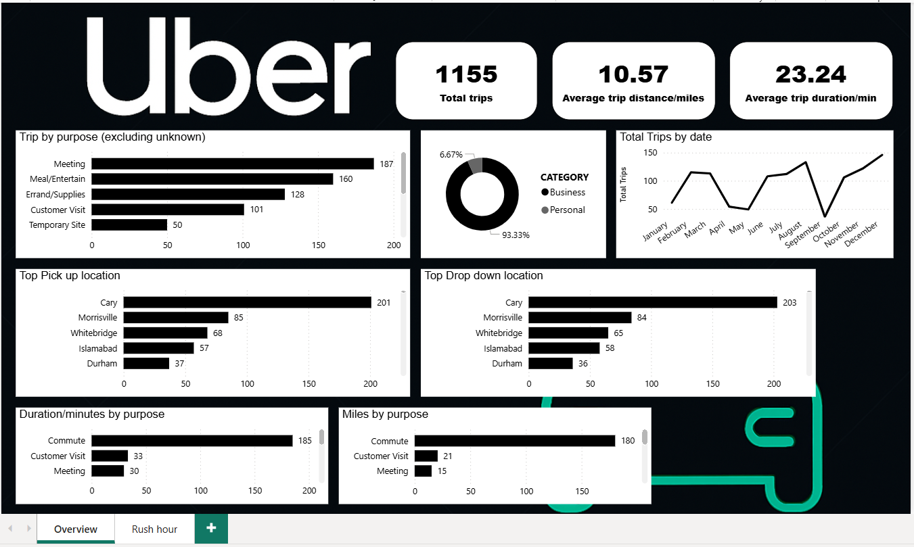

## 🚗 Uber Trips Power BI Dashboard

An interactive Power BI dashboard uncovering insights from Uber trip data.  
This project demonstrates end‑to‑end data analysis — from cleaning and transformation to visualization — revealing key travel patterns across business and personal trips, trip purposes, top locations, durations, and rush‑hour trends.

---

## 🧭 Project Overview
The goal of this project is to analyze Uber trip data and identify meaningful patterns such as most frequent trip purposes, top pickup and drop‑off locations, distance and duration trends, and the busiest hours of the day.  

By combining Power Query data preparation, DAX calculations, and Power BI visual analytics, the dashboard delivers an intuitive overview of urban mobility behavior.

---

## 🧹 Data Cleaning & Transformation
Before creating visuals, data was carefully prepared in Power BI’s **Power Query Editor**:

- Replaced all `null` values with **"Unknown"**  
- Removed an unnecessary **"Total"** summary row  
- Standardized **distance values** to one decimal place for consistency  
- Unified all **datetime columns** using the `day/month/year` format  
- Calculated **trip duration (in minutes)** based on start and end times  
- Created **duration bins** with a 15‑minute interval for duration analysis  
- Added a **Start Time column** to highlight the busiest travel hours of the day  

This process ensured that the dataset was consistent, reliable, and ready for analytical modeling.

---

## 🧱 Data Model

- **Source:** Uber trips dataset 
- **Structure:** Single fact table with calculated columns for duration, duration bins, and start time ,   
- **Approach:** DAX measures and calculated columns for KPIs and visual breakdowns  

## 🧮 Key DAX Measures
```DAX
Total Trips = COUNTROWS('Trips')
Average Trip Distance = ROUND(AVERAGE('Trips'[Miles]), 1)
Average Trip Duration = AVERAGE('Trips'[Duration_Min])
---

## 📂 Repository Structure 

---


## 🖼️ Dashboard




---
